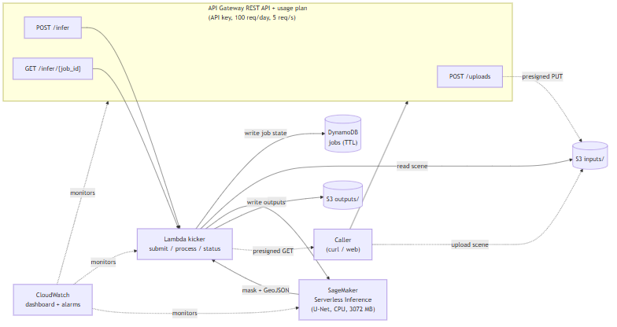

# sar-flood-extent-aws

[](https://github.com/Governor6191/sar-flood-extent-aws/actions/workflows/deploy.yml)
[](https://github.com/Governor6191/sar-flood-extent-aws/actions/workflows/pr-check.yml)

Serverless AWS deployment of the [sar-flood-extent](https://github.com/Governor6191/sar-flood-extent)
model: a U-Net that segments flood water from Sentinel-1 SAR imagery. This repo
takes the released model and ships it as a live HTTP inference API, reproducible
from a single `cdk deploy`, with CI/CD, monitoring, and a documented cost
envelope.

The research repo proves the model works. This one ships it.

## What it does

You submit a Sentinel-1 SAR scene and get back a flood-extent mask (GeoTIFF) plus
a GeoJSON of flood polygons. Inference can take longer than API Gateway's 29
second limit, so the API is asynchronous: submit a job, poll for status, download
the result from a presigned URL when it is done.

```bash
export API="https://dne7hggf3f.execute-api.us-east-1.amazonaws.com/demo"
export API_KEY="<demo key, rate-limited to 100 req/day>"

# 1. ask for a presigned upload URL
curl -s -X POST "$API/uploads" -H "x-api-key: $API_KEY"
# -> { "input_key": "inputs/.../scene.tif", "upload_url": "https://...", ... }

# 2. upload a Sentinel-1 crop to that URL
curl -s -X PUT --upload-file scene.tif "<upload_url>"

# 3. submit the job
curl -s -X POST "$API/infer" -H "x-api-key: $API_KEY" \
  -H "content-type: application/json" \
  -d '{"input_key": "inputs/.../scene.tif"}'
# -> { "job_id": "...", "status": "queued" }

# 4. poll until done, then download the mask and GeoJSON
curl -s "$API/infer/<job_id>" -H "x-api-key: $API_KEY"
# -> { "status": "done", "water_fraction": 0.0266, "mask_url": "...", "geojson_url": "..." }
```

Full request and response schema: [docs/usage.md](docs/usage.md) and
[docs/api_contract.md](docs/api_contract.md). The demo key is rate-limited; ask
for one, or deploy your own copy with the CDK app below.

## Architecture



- **SageMaker Serverless Inference** runs the model. It scales to zero, so idle
  cost is zero, and there is no instance to keep warm.
- **API Gateway (REST)** fronts a **Lambda kicker**. The kicker writes a job
  record to **DynamoDB**, reads the uploaded scene from **S3**, invokes the
  endpoint, writes the mask and GeoJSON back to S3, and updates the job. A second
  asynchronous invocation does the inference so the submit call returns
  immediately.
- **API key + usage plan** (100 req/day, 5 req/s) keep the public URL from being
  abused. The SageMaker endpoint caps concurrency at 1.
- **S3 lifecycle** purges inputs and outputs after 7 days. DynamoDB rows expire
  on a TTL. Idle cost stays near zero.

The same container image serves the local FastAPI app and the SageMaker endpoint:
it exposes `/ping` and `/invocations` alongside `/health` and `/infer`, so Stage
2 reuses the Stage 1 image with no rebuild.

## Deploy it yourself

```bash
# one-time per account/region
cdk bootstrap aws://<account>/us-east-1

# build and push the container, then deploy the stack
aws ecr create-repository --repository-name sar-flood-aws --region us-east-1
aws ecr get-login-password --region us-east-1 \
  | docker login --username AWS --password-stdin <account>.dkr.ecr.us-east-1.amazonaws.com
docker build --provenance=false --sbom=false -t <account>.dkr.ecr.us-east-1.amazonaws.com/sar-flood-aws:latest .
docker push <account>.dkr.ecr.us-east-1.amazonaws.com/sar-flood-aws:latest

cd cdk && cdk deploy --require-approval never
```

`cdk destroy` tears the whole stack back down to zero cost. Details and context
options are in [cdk/README.md](cdk/README.md). On every push to `main`, GitHub
Actions rebuilds the image and redeploys via OIDC, with no long-lived AWS keys in
the repo.

## Latency

Measured against the live serverless endpoint with a Sentinel-1 crop.

| | round-trip | notes |
|---|---|---|
| cold start | ~14 s | container spin-up + model load on the first request after idle |
| warm (p50) | ~1.2 s | of which ~0.9 s is inference |

Weights are baked into the image, so the cold start has no model download. See
[docs/latency_baseline.md](docs/latency_baseline.md).

## Cost

Built to stay near free. The account is days old, so AWS Cost Explorer has not
ingested a full picture yet; these are the projected numbers from the
architecture and AWS pricing, to be replaced with measured month-to-date figures
after a billing cycle.

- **Idle: $0/month.** Nothing runs when no one is calling. SageMaker Serverless
  scales to zero, Lambda and API Gateway bill per request, DynamoDB is on-demand,
  and S3 holds only a handful of small objects that the 7-day lifecycle purges.
  The 3 CloudWatch alarms and 1 dashboard sit inside the always-free tier.
- **Per inference: a fraction of a cent** for a warm crop. The cost is dominated
  by SageMaker Serverless compute, billed per millisecond scaled by the 3072 MB
  memory; API Gateway, Lambda, and S3 add rounding error. A cold start bills a
  longer duration but still lands under a cent.
- **At the demo cap** (100 req/day usage plan) the worst case is on the order of a
  few dollars a month, and realistic portfolio traffic is far below that. The $5
  and $25 AWS Budgets alarms are the backstop.

For the first 12 months a fresh account's free tier covers the API Gateway,
Lambda, S3, and CloudWatch usage outright.

## Accuracy

The deployment path is the research path. The API reproduces the local inference
mask bit for bit: an end-to-end run (upload, infer, download) on a Harvey crop
matches local inference at 100% pixel agreement (water-class IoU 1.0), and the
full Hurricane Harvey 2017 scene matches the research-repo reference at 99.9985%
pixel agreement. This repo does not retrain or modify the model. It deploys it.

The model itself, its training, and the Copernicus EMS validation are documented
in the [research repo](https://github.com/Governor6191/sar-flood-extent).

## Input size

The demo accepts Sentinel-1 crops (the serverless endpoint payload limit is about
4 MB). The full Harvey scene (340 MB) is validated locally and in the container;
running a full scene through the endpoint would need a serverless memory quota
increase or a tiled S3 read path. See [future work](#future-work).

## Future work

- Tiled S3 streaming read so full scenes run through the endpoint without the
  payload limit.
- A small web demo on the portfolio site (upload a crop, see the mask on a map).
- Provisioned concurrency or a scheduled warm-up to cut the cold start, if a use
  case needs it.

## Layout

```
src/            inference core and FastAPI service (local + SageMaker)
lambda/kicker/  async API backend (presign, submit, process, status)
cdk/            CDK Python app: the whole stack as code
tests/          unit tests and an integration test
docs/           API contract, usage, latency, deploy notes, figures
.github/        deploy (push to main) and PR-check workflows
```

## License

[MIT](LICENSE).
